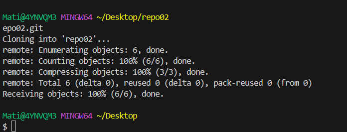
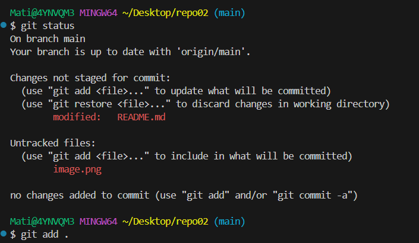
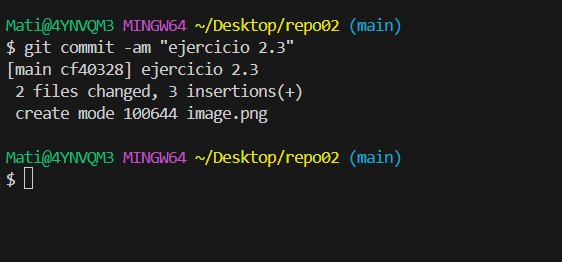

# repo02
2.1 Crea un repositorio llamado repo02 desde GitHub. ¿Seria considerado un repositorio local o remoto?  
Respuesta: Remoto
  
2.2 Posteriormente, Clónalo (mediante al comando git clone), lo que realizara una copia del repositorio remoto en nuestro equipo, creando con ello un repositorio local a partir del repositorio en remoto
  

2.3 Añade un fichero readme.md y ejecuta los comandos pertinentes hasta llegar a poder realizar un commit.
  
